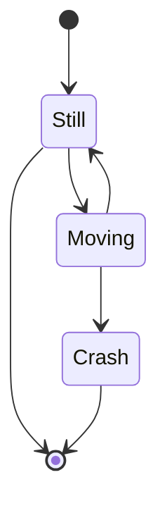

---
jijoijweorasdfojwerl
---


# This is a new TestFile

* from liujianan

* date

  


> joweiji
>
> `jijoi` jiojioj` ioji` 
>
> ``` jiojiewr``` 
>
>  

## 红色

* jiojiewf

* 即

  1. 迥旺i饥饿反

     及joie
     解耦i窘

     阿韦杰夫  

     jojoba    

     叫我就二分  
     解耦i

     

     


链接哦iJoe发
解耦i阿文joie发

基金哦i  
囧joie我


解耦i解耦i违法
及Joe发  

急哦

急哦

建瓯微软

解耦i就哇哦i二
教教我i二

解耦i结尾

1. 解耦i叫我欸日
   我今儿哦i日记
   解耦i阿文人家哦

较为人

破旗为人品 

吉欧吉安我i二

哦i啊较为人
解耦i阿娇围殴日 

* 迥旺Jeri
  * 较为今日哦
    骄傲i微软
    	叫温柔i
    哦i阿娇温柔i
  * 解耦i建瓯微软
  * 解耦i啊我姐哦人 

几哦啊微软

- [x] joi奇偶位进入
- [x] 啊温热
  较为人
- [x] 解耦i瓦基尔哦

哦囧问人家

``` jowjeorij
joijwqeoirj 
```

解耦i哦i七五九二

~~~gfm
```ruby
require 'redcarpet'
markdown = Redcarpet.new("Hello World!")
puts markdown.to_html
```
~~~

~~~gfm
```
function test() {
  console.log("notice the blank line before this function?");
}
```
~~~

$$
\mathbf{V}_1 \times \mathbf{V}_2 =  \begin{vmatrix} 
\mathbf{i} & \mathbf{j} & \mathbf{k} \\
\frac{\partial X}{\partial u} &  \frac{\partial Y}{\partial u} & 0 \\
\frac{\partial X}{\partial v} &  \frac{\partial Y}{\partial v} & 0 \\
\end{vmatrix}
$$

| ojaoiwer | joaweor |
| -------- | ------- |
|          |         |

[^footnote]: Here is the **text** of the ***\*footnote\****.
[^footnote]: Here is the **text** of the ***\*footnote\****.

**joawierj** *jweoir* ojoawjeroijoi 

***

---


~~~gfm

~~~

[^脚注]: zhelishi jiaozhu  *jijiejr* of the **joeir** 

~~~gfm
```flow
st=>start: Start
op=>operation: Your Operation
cond=>condition: Yes or No?
e=>end

st->op->cond
cond(yes)->e
cond(no)->op
```
~~~

```
    Alice->>John: Hello John, how are you?
    John-->>Alice: Great!
    Alice-)John: See you later!
```

```
sequenceDiagram
    actor Alice
    actor Bob
    Alice->>Bob: Hi Bob
    Bob->>Alice: Hi Alice
```

 

```
sequenceDiagram
    participant Alice
    participant John

    rect rgb(191, 223, 255)
    note right of Alice: Alice calls John.
    Alice->>+John: Hello John, how are you?
    rect rgb(200, 150, 255)
    Alice->>+John: John, can you hear me?
    John-->>-Alice: Hi Alice, I can hear you!
    end
    John-->>-Alice: I feel great!
    end
    Alice ->>+ John: Did you want to go to the game tonight?
    John -->>- Alice: Yeah! See you there.
```

This is [an example](http://example.com/ "Title") inline link. [This link](http://example.net/) has no title attribute.

This is [an example][id] reference-style link. 然后，在文档中的任何位置，您可以单独定义链接标签，如下所示： [id]: http://example.com/  "Optional Title Here"


*jijoi* 

_joijo_ 

\*jojijeor\* 


~~jojoijwoeri~~ 

<u>jiojoijeorjoi</u> awerwer  

 `Edit` -> `Emoji & Symbols`

:cry:

```
$\lim_{x \to \infty} \exp(-x) = 0$
```


$$
\lim_{x \to \infty} \exp(-x) = 0
$$
==joajwiejr== 

